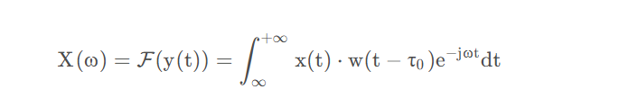
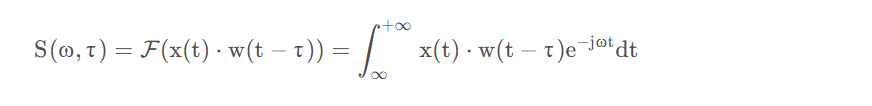

使用短时傅里叶变换原因：
傅里叶变换只能对一段时间的信号总体上包含哪些频率成分做分析，但是无法描述各成分出现的时刻因此时域相差很大频域可能相同，且对于时域的突变，频域难以捕捉，我们还需要知道各个频率出现的时间，各时刻瞬时频率及幅值
短时傅里叶变换即对小段信号做fft：
具体方法为定义一个窗函数并做时移，然后对取出的一小段x(t)做傅里叶变换

对应到离散场景中，S [ ω , τ ]  就是一个二维矩阵，每一列代表了在不同位置对信号加窗，对得到的分段进行傅里叶变换后的结果序列。

完成对一个 τ的傅里叶变换后再移动窗函数，窗函数移动距离叫hop size，小于窗口宽度，所以窗之间会有重叠叫overlap
