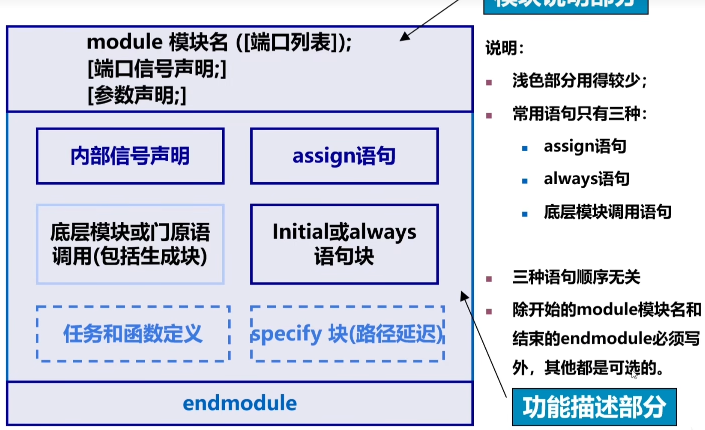
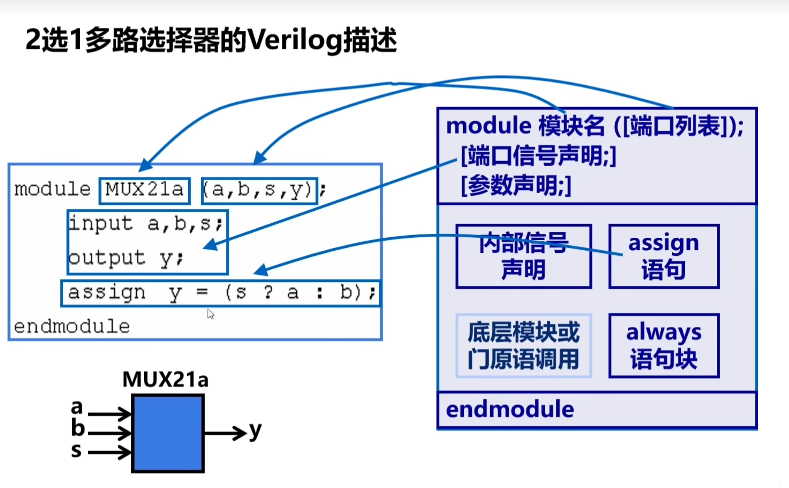
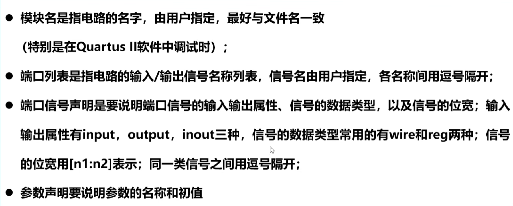
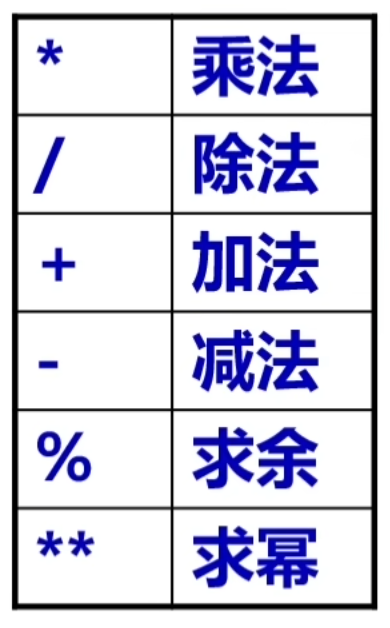
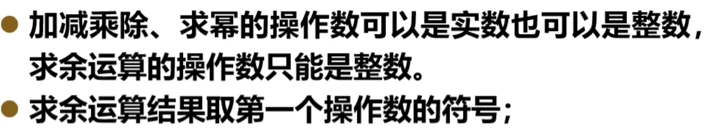
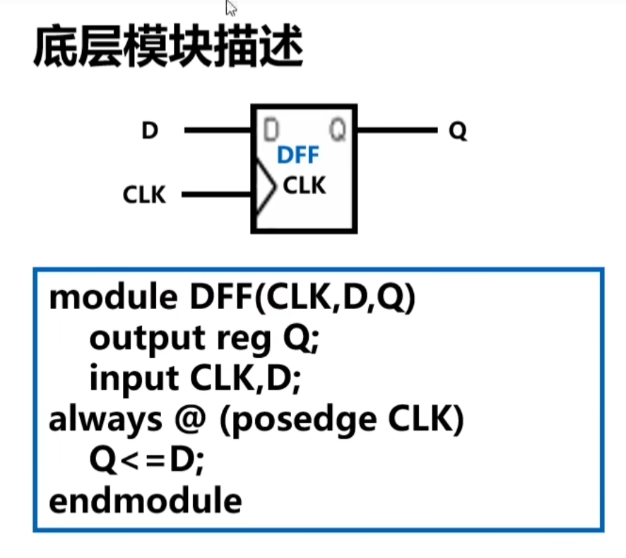
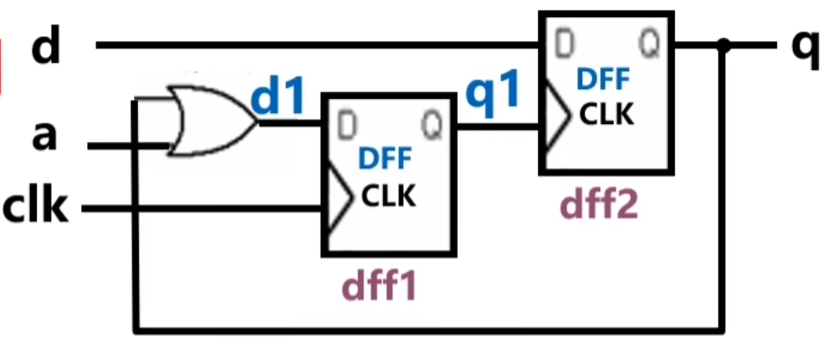
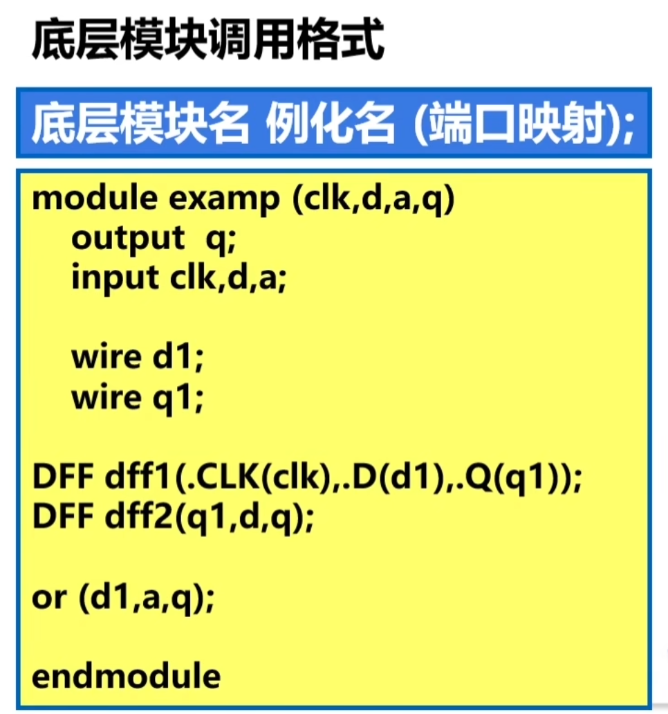

## verilog设计方法

自上而下设计


## 基础语法

- 区分大小写
- 分号作为语句结束符
- 空格无意义
- //单行注释    /*  */多行注释
- 标识符：自定义名字  关键字：具有一定功能的语言标识

### 数值表示

#### 数值种类

- 0：假
- 1：真
- x or X：未知
- Z or z：高阻

#### 整数表示方法

- <bits>'<representation><value>，其中 bits 指定数据的位宽，representation 指定数据用何种进制来描述，可以是 2 进制（b 或 B）、8 进制（o 或 O）、10 进制（d 或 D）、16 进制（h 或 H），value 指定数据的具体数值
- example：
- 4'b1011         // 4bit 数值
  32'h3022_c0de   // 32bit 的数值
- 当直接写数字不指明位宽和进制时默认十进制
- 负数：在表示位宽的数字前加‘-’

#### 实数表示：

1. 十进制

2. 科学计数：

   1.2e4         //大小为12000
   1_0001e4      //大小为100010000
   1E-3          //大小为0.001

#### 字符串：

双引号包围，不可以换行

### 数据类型

#### 线网（wire）

wire表示的是物理连线，wire的电平由连接到的器件决定且与器件相同，若没有驱动的器件连接到wire则wire值为z

#### 寄存器（reg）

表示储存单元，会保持原有值直到改写

仿真时，reg的值可以通过赋值号改写

``` verilog
reg rstn;
initial begin
    rstn = 1'b0;
end
```

#### 向量

当位宽大于1时，wire或者reg可以被声明为向量

例如：reg [3:0] counter;声明了一个最高位为3，最低位为0的位宽为4的寄存器counter

##### 位选择

访问向量的单个位如：data[0]会选择data的最低位

##### 部分选择

可以选择向量的部分连续位

data[9:0]会选择最低位0到最高位9

并且向量域的选择可以是可变的

reg [31:0]     data1 ;
reg [7:0]      byte1 [3:0];
integer j ;
always@* begin
    for (j=0; j<=3;j=j+1) begin
        byte1[j] = data1[(j+1)*8-1 : j*8]; 
        //把data1[7:0]…data1[31:24]依次赋值给byte1[0][7:0]…byte[3][7:0]
    end
end

#### bit位后固定位宽的向量域选择访问

- **[bit+: width]** : 从起始 bit 位开始递增，位宽为 width。
- **[bit-: width]** : 从起始 bit 位开始递减，位宽为 width。

//下面 2 种赋值是等效的
A = data1[31-: 8] ;
A = data1[31:24] ;

//下面 2 种赋值是等效的
B = data1[0+ : 8] ;
B = data1[0:7] ;

#### 把信号进行组合时，需要借助大括号

```verilog
wire [31:0] temp1,temp2;
assign temp1 = {byte[0][7:0],date[31:8]};
assign temp2 = {32{1'b0}}
```

### 整数（integer）

使用integer声明，且声明时不用指明位宽

```verilog
integer i
```

### 实数（real）

用real声明，可用十进制或者科学计数法表示，若将实数赋值给整数则只有整数部分会被赋值

```verilog
real i
```

### 时间（time）

一般使用特殊的时间寄存器time变量对仿真时间保存可以通过$time获取当前的仿真时间

```verilog
time       current_time ;
initial begin
       #100 ;
       current_time = $time ; //current_time 的大小为 100
end
```

### 数组

```verilog
integer          flag [7:0] ; //8个整数组成的数组
reg  [3:0]       counter [3:0] ; //由4个4bit计数器组成的数组
wire [7:0]       addr_bus [3:0] ; //由4个8bit wire型变量组成的数组
wire             data_bit[7:0][5:0] ; //声明1bit wire型变量的二维数组
reg [31:0]       data_4d[11:0][3:0][3:0][255:0] ; //声明4维的32bit数据变量数组
```

```verilog
flag [1]   = 32'd0 ; //将flag数组中第二个元素赋值为32bit的0值
counter[3] = 4'hF ;  //将数组counter中第4个元素的值赋值为4bit 十六进制数F，等效于counter[3][3:0] = 4'hF，即可省略宽度; 
assign addr_bus[0]        = 8'b0 ; //将数组addr_bus中第一个元素的值赋值为0
assign data_bit[0][1]     = 1'b1;  //将数组data_bit的第1行第2列的元素赋值为1，这里不能省略第二个访问标号，即 assign data_bit[0] = 1'b1; 是非法的。
data_4d[0][0][0][0][15:0] = 15'd3 ;  //将数组data_4d中标号为[0][0][0][0]的寄存器单元的15~0bit赋值为3
```

### 存储器

存储器变量就是寄存器数组，可以描述RAM或ROM

```verilog
reg membit[0:255];//256bit
reg [7:0] mem[0:1023];//1Kbyte 位宽8bit
mem[511] = 8'b0;//令第511个8bit存储0
```

### 参数

用parameter声明，只能赋值一次

```verilog
parameter      data_width = 10'd32 ;
parameter      i=1, j=2, k=3 ;
parameter      mem_size = data_width * 10 ;
```

## 表达式

### 表达式

a^b// a与b进行异或

### 操作符

- 单目运算：+ - ！ ~
- 乘除取模：* / %
- 加减 + -
- 移位 << >>
- 关系< <= > >=
- 等价 ==    !=    ===(严格等价：ture!=\=\=1)      !\=\=\=

## verilo 模块结构





### 模块说明部分

```
module 模块名 ([端口列表])；
	[端口信号说明;]
	[参数声明;]
```



例:

```verilog
module full_adder (A,B,CIN,S,COUT);
	input [3:0] A,B;
	input CIN;
	output reg [3:0] S;
	output COUT;
```

**位宽默认为1**

**数据类型默认为wire**

### assign语句

assign即为连续赋值

```verilog
assign y = Q;
assign y = a&b;
```

- 之所以说是连续赋值语句，是一位当表达式中的操作数有变化时立即进行计算和赋值（与之对应的是过程赋值语句）
- 赋值目标必须是wire型的，wire表电路间的连接

#### 算数运算





#### 逻辑型

- ！非
- && 与
- || 或
- 逻辑值非0 被判定为1

#### 等价运算

- ==等于
- ！=不等于
- ===case等于
- ！==case不等

**等于和不等于的结果可以为x或z，但是case等于或不等结果只能是1或0**

### 按位操作

- ~按位非   （每一位取非）
- &按位与    （0决定）
- |按位或       （1决定）
- ^按位异或         （异为1）
- ~^按位同或          （同为1）

### 缩减运算

将一个二进制数从左到右进行逻辑运算，结果只有一位

- &缩减与 从左到右依次与运算（0决定）
- ~& 缩减与非 缩减与后取非
- |缩减或
- ~|缩减或非
- ^缩减异或
- ~^缩减同或

#### 移位运算

- \>\> 右移 
- <\< 左移
- \>>> 算数右移
- \<<<算数左移

右移：所有位数向右移，最左边补零

算术右移：所有位数向右移，最左边补最右边的数

```
Y = 4' b1001 >> 1;//结果为 0100
Y = 4' b1001 >>> 1;//结果为1100
```

#### 拼接赋值运算

- {}拼接
- {{}}拼接复制

```
Y = {4' b1001,2' b11};//结果为100111 直接拼一起
Y = {4{2' b01}};//结果为01010101 就是复制然后拼一起
```

#### 条件运算符

？：用于条件复制

**Y = a ? b : c**

如果a=1 ，y= b

如果a = 0 ，y = a

如果a = x ，y = x

## always语句块

always就是过程块

```
always@(敏感信号条件表)
	各类顺序语句；
```

always的赋值必须是reg类型

**只有当敏感条件满足时，always语句才被激活**

**敏感条件分为边沿敏感和电平敏感**

#### 边沿敏感

> (posedge 信号名) 上升沿
>
> (negedge 信号名) 下降沿

#### 电平敏感

> (信号名列表) 信号名列表中任意一个信号有电平变化

如：(a,b,c) 

**always语句块中如果有多条赋值语句必须将其用begin end包括起来，assign语句中没有begin end**

#### 阻塞赋值与非阻塞赋值

```verilog
//阻塞赋值
always@(A,B)
begin
	M1=A;//计算A后马上赋值给M1
	M2=B&M1;//再计算B&M1后马上赋值给M2
	Q=M1|M2;//同理
end
```

```verilog
//非阻塞赋值
always@(A,B)
begin
	M1<=A;//计算A
	M2<=B&M1;//再计算B&M1
	Q<=M1|M2;//同理
end
//过程结束后统一赋值
```

## 底层模块和门原语调用

### 底层模块调用






